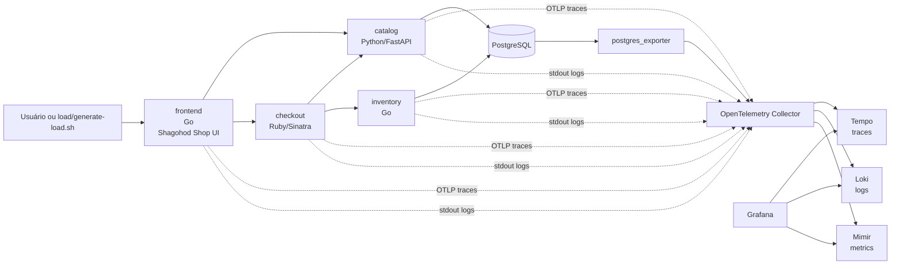

# Arquitetura

O laboratório representa a **Shagohod Shop**, uma loja virtual pequena com estética fan-made tática/jungle-tech. Ele não tenta ser uma cópia completa da OpenTelemetry Demo; a ideia é manter poucos serviços, mas garantir que cada conceito importante apareça.

## Decisões

- Kind foi escolhido porque cria um Kubernetes real localmente sem depender de cloud.
- Manifests puros foram escolhidos porque o ambiente já tinha `kind`, `kubectl` e `docker`, mas não `helm`.
- A stack LGTM roda em modo monolítico para reduzir custo operacional no laptop.
- O Collector é o único destino direto das aplicações. Isso reforça a boa prática de centralizar pipelines, enriquecimento, batching e exportação.

## Fluxos importantes

- `/`: renderiza a vitrine visual da Shagohod Shop.
- `/api/products`: `frontend` chama `catalog` e `inventory` para montar a vitrine com estoque.
- `/api/cart`: registra ação de carrinho e gera logs/spans com `shop.session_id`.
- `/api/checkout`: executa checkout real via `checkout`, que chama `catalog` e `inventory`.
- `/error-demo`: força pagamento recusado para gerar traces com erro.
- `?slow=true`: injeta latência no `inventory` para aparecer em duration e p95.

O cookie `shop_session_id` é propagado internamente como `x-shop-session-id` e gravado como atributo `shop.session_id`.
